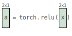
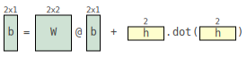

# Tensor Sensor

The goal of this library is to generate more helpful exception
messages for numpy/pytorch/tensorflow matrix algebra expressions.  Because the
matrix algebra in these libraries is all done in C/C++, they do not
have access to the Python execution environment so they are literally
unable to give information about which Python variables and subexpression caused the problem.  Only by catching the exception and then analyzing/re-executing the Python code can we get this kind of an error message.

The Python `with` statement allows me to trap exceptions that occur
and then I literally parse the Python code of the offending line, build an
expression tree, and then incrementally evaluate the operands
bottom-up until I run into an exception. That tells me which of the
subexpressions caused the problem and then I can pull it apart and
ask if any of those operands are matrices.

Imagine you have a complicated little matrix expression like:

```
W @ torch.dot(b,b)+ torch.eye(2,2)@x + z
```

And you get this unhelpful error message from pytorch:

```
RuntimeError: 1D tensors expected, got 2D, 2D tensors at [...]/THTensorEvenMoreMath.cpp:83
```

There are two problems: it does not tell you which of the sub
expressions threw the exception and it does not tell you what the
shape of relevant operands are.  This library that lets you
do this:

```
import tsensor
with tsensor.clarify():
    W @ torch.dot(b,b)+ torch.eye(2,2)@x + z
```

which then augments the exception message with the following clarification:

```
Cause: torch.dot(b,b) tensor arg b w/shape [2, 1], arg b w/shape [2, 1]
```

Here’s another default error message that is almost helpful for expression `W @ z`:

```
RuntimeError: size mismatch, get 2, 2x2,3
```

But tensor-sensor gives:

```
Cause: @ on tensor operand W w/shape [2, 2] and operand z w/shape [3]
```

Non-tensor args/values are ignored.

```
with tsensor.clarify():
    torch.dot(b, 3)
```

gives:

```
TypeError: dot(): argument 'tensor' (position 2) must be Tensor, not int
Cause: torch.dot(b,3) tensor arg b w/shape [2, 1]
```

If there are no tensor args, it just shows the cause:

```
with tsensor.clarify():
    z.reshape(1,2,2)
```

gives:

```
RuntimeError: shape '[1, 2, 2]' is invalid for input of size 3
Cause: z.reshape(1,2,2)
```

## Visualizations

For more, see [examples.ipynb](testing/examples.ipynb).

```python
import tsensor
import graphviz
import torch
import sys

W = torch.tensor([[1, 2], [3, 4]])
b = torch.tensor([9, 10]).reshape(2, 1)
x = torch.tensor([4, 5]).reshape(2, 1)
h = torch.tensor([1,2])

with tsensor.explain():
    a = torch.relu(x)
    b = W @ b + h.dot(h)
```

Displays this in a notebook:






## Install

```
pip install -U graphviz # make sure you have latest
pip install tensor-sensor
```

which gives you module `tsensor`. I developed and tested with the following versions

```
$ pip list | grep -i flow
tensorflow                         2.3.0
tensorflow-estimator               2.3.0
$ pip list | grep -i numpy
numpy                              1.18.5
numpydoc                           1.1.0
$ pip list | grep -i torch
torch                              1.6.0
```


## Limitations

I rely on parsing lines that are assignments or expressions only so the clarify and explain routines do not handle methods expressed like:

```
def bar(): b + x * 3
```

Instead, use

```
def bar():
	b + x * 3
```

watch out for side effects!  I don't do assignments, but any functions you call with side effects will be done while I reevaluate statements.

Can't handle `\` continuations.

Also note: I've built my own parser to handle just the assignments / expressions tsensor can handle.

## Deploy (parrt's use)

```bash
$ python setup.py sdist upload 
```

Or download and install locally

```bash
$ cd ~/github/tensor-sensor
$ pip install .
```

## Notes

The behavior of clarify. Clarify has no burden on the run time unless an exception occurs. At this time, it reevaluates the offending line looking for the self-expression that caused the problem. It not only updates the error message in the exception object, but it visualizes the error.

The behavior of explain.  Explain is a big burden on runtime execution. Before every line is executed, explain will evaluate all sub expressions and produce a visualization. Then, the line executes normally. If there is an exception in that line, we detected during visualization and display an altered view of that statement that highlights the offending sub expression.  We also need to behave like clarify for the error message in the exception triggered when the Python VM executes that statement normally (after are visualization).

So, in both cases, we trap exceptions using the `with` construct and augment exception messages. Explain differs from clarify in that we use `settrace()` to process each line of code before the VM executes it normally.  Clarify never needs to deal with tracing.

### TODO

* can i call pyviz in debugger?
* try on real examples
* `dict(W=[3,0,1,2], b=[1,0])` that would indicate (300, 30, 60, 3) would best be displayed as (30,60,3, 300) and b would be  first dimension last and last dimension first