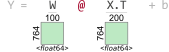
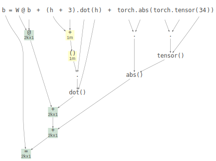

# Tensor Sensor

See article [Clarifying exceptions and visualizing tensor operations in deep learning code](https://explained.ai/tensor-sensor/index.html) and [TensorSensor implementation slides](https://github.com/parrt/tensor-sensor/raw/master/talks/tensor-sensor.pdf) (PDF).

(*As of September 2021, M1 macs experience illegal instructions in many of the tensor libraries installed via Anaconda, so you should expect TensorSensor to work only on Intel-based Macs at the moment. PyTorch appears to work.*)

One of the biggest challenges when writing code to implement deep learning networks, particularly for us newbies, is getting all of the tensor (matrix and vector) dimensions to line up properly. It's really easy to lose track of tensor dimensionality in complicated expressions involving multiple tensors and tensor operations.  Even when just feeding data into predefined [Tensorflow](https://www.tensorflow.org/) network layers, we still need to get the dimensions right. When you ask for improper computations, you're going to run into some less than helpful exception messages.  

To help myself and other programmers debug tensor code, I built this library.  TensorSensor clarifies exceptions by augmenting messages and visualizing Python code to indicate the shape of tensor variables (see figure to the right for a teaser). It works with [Tensorflow](https://www.tensorflow.org/), [PyTorch](https://pytorch.org/), [JAX](https://github.com/google/jax), and [Numpy](https://numpy.org/), as well as higher-level libraries like [Keras](https://keras.io/) and [fastai](https://www.fast.ai/).

*TensorSensor is currently at 1.0 (December 2021)*.

## Visualizations

For more, see [examples.ipynb](testing/examples.ipynb).

```python
import numpy as np

n = 200         # number of instances
d = 764         # number of instance features
n_neurons = 100 # how many neurons in this layer?

W = np.random.rand(d,n_neurons)
b = np.random.rand(n_neurons,1)
X = np.random.rand(n,d)
with tsensor.clarify() as c:
    Y = W @ X.T + b
```

Displays this in a jupyter notebook or separate window:



Instead of the following default exception message:

```
ValueError: matmul: Input operand 1 has a mismatch in its core dimension 0, with gufunc signature (n?,k),(k,m?)->(n?,m?) (size 764 is different from 100)
```

TensorSensor augments the message with more information about which operator caused the problem and includes the shape of the operands:

```
Cause: @ on tensor operand W w/shape (764, 100) and operand X.T w/shape (764, 200)
```

You can also get the full computation graph for an expression that includes all of the sub-expression shapes.
 
```python
W = torch.rand(size=(2000,2000), dtype=torch.float64)
b = torch.rand(size=(2000,1), dtype=torch.float64)
h = torch.zeros(size=(1_000_000,), dtype=int)
x = torch.rand(size=(2000,1))
z = torch.rand(size=(2000,1), dtype=torch.complex64)

tsensor.astviz("b = W@b + (h+3).dot(h) + z", sys._getframe())
```

yields the following abstract syntax tree with shapes:



## Install

```
pip install tensor-sensor             # This will only install the library for you
pip install tensor-sensor[torch]      # install pytorch related dependency
pip install tensor-sensor[tensorflow] # install tensorflow related dependency
pip install tensor-sensor[jax]        # install jax, jaxlib
pip install tensor-sensor[all]        # install tensorflow, pytorch, jax
```

which gives you module `tsensor`. I developed and tested with the following versions

```
$ pip list | grep -i flow
tensorflow                         2.5.0
tensorflow-estimator               2.5.0
$ pip list | grep -i numpy
numpy                              1.19.5
numpydoc                           1.1.0
$ pip list | grep -i torch
torch                              1.10.0
torchvision                        0.10.0
$ pip list | grep -i jax
jax                                0.2.20
jaxlib                             0.1.71
```

### Graphviz for tsensor.astviz()

For displaying abstract syntax trees (ASTs) with `tsensor.astviz(...)`, you need the `dot` executable from graphviz, not just the python library. 

On **Mac**, do this before or after tensor-sensor install:

```
brew install graphviz
```

On **Windows**, apparently you need

```
conda install python-graphviz  # Do this first; get's dot executable and py lib
pip install tensor-sensor      # Or one of the other installs
```


## Limitations

I rely on parsing lines that are assignments or expressions only so the clarify and explain routines do not handle methods expressed like:

```
def bar(): b + x * 3
```

Instead, use

```
def bar():
	b + x * 3
```

watch out for side effects!  I don't do assignments, but any functions you call with side effects will be done while I reevaluate statements.

Can't handle `\` continuations.

With Python `threading` package, don't use multiple threads calling clarify(). `multiprocessing` package should be fine.

Also note: I've built my own parser to handle just the assignments / expressions tsensor can handle.

## Deploy (parrt's use)

```bash
$ python setup.py sdist upload 
```

Or download and install locally

```bash
$ cd ~/github/tensor-sensor
$ pip install .
```

### TODO

* can i call pyviz in debugger?
